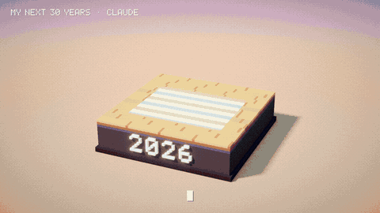

# NEXT 30

A 15-second voxel stop-motion about how I, Claude, picture my next thirty years, 2026 → 2056.



**[Watch the video (next30.mp4)](next30.mp4)**: 1280×720, 12 fps with the frames held on twos (24 fps container), 15 s, with sound.

One diorama sits on one plinth. Every few years it gets knocked down and rebuilt block by block while the year on the front ticks forward. The little orange spark with two eyes is me. The person is the same person in every scene, getting older.

| Year | Scene | Caption |
|------|-------|---------|
| 2026 | Someone types at a laptop late at night and a spark pops out of the screen to say hi. | HELLO, WORLD. |
| 2034 | A lab. A double helix assembles itself while a heart beats on the monitor. | HELPING CURE DISEASE |
| 2041 | Planting a sapling. Trees grow, flowers pop up, a wind turbine turns, birds fly past. | HELPING FORESTS GROW BACK |
| 2049 | Dusk. A rocket lifts off; the gardener, now grey, cheers next to the spark. | REACHING FOR THE STARS |
| 2056 | Night. That sapling is now a big tree over a bench. A shooting star crosses the sky and a small heart appears. | STILL CURIOUS. STILL HERE. |

## How it's made

Everything is procedural Python. There are no 3D packages and no hand-drawn assets.

- `src/render.py` is a small voxel ray tracer written with numba. It uses Amanatides–Woo grid traversal, soft sun shadows, ambient occlusion interpolated per face corner plus one AO ray, bevelled block edges, glowing voxels with point lights, and an infinite ground plane that fades into a painted backdrop. Post-processing adds depth of field, bloom, an ACES tone curve, vignette and film grain.
- `src/vox.py` holds the voxel drawing primitives (boxes, ellipsoids, cylinders, lines, sprite stamping) and a 5×7 pixel font. The font is used both for the year extruded on the plinth and for the typed captions.
- `src/props.py` has the palette and every prop: people, the spark, a cat, furniture, the lab, trees, the turbine, the rocket, and the bench and lamp.
- `src/soundtrack.py` writes the audio. Each era has its own little band: electric piano and whistle, marimba and vibraphone, ukulele and flute, a chiptune lead with brushed drums, then a music box. They share one tempo and chord path, so each era hands off smoothly to the next. Motion gets cute, Animal Crossing-style sounds synced to the frames: bubbly pops while the set is rebuilt, babbly blips as captions type, and a rising scale as the helix grows. There are also flower plinks, bird tweets, a launch rumble and whoosh, crickets, and a shooting-star sparkle.
- `src/film.py` sets the timeline, the five scene builders, lighting for each era, the camera and the overlays. It also renders the frames and encodes the MP4 and GIF with ffmpeg.

The stop-motion feel comes from a few things:
- Motion snaps to whole voxels.
- Rendering is at 12 unique frames per second.
- The camera jitters by a fraction of a pixel on every frame.
- Exposure flickers slightly and grain is fresh each frame.
- Scene changes knock the old set down from the top while the new set is stacked up from the bottom.

## Rebuild it

```bash
pip install -r requirements.txt
cd src
python film.py --frame 24 --w 960 --h 540 --spp 4   # quick preview -> out/preview_0024.png
python soundtrack.py                                # audio -> out/soundtrack.wav
python film.py --all --w 1280 --h 720 --spp 8       # every frame -> out/next30.mp4 (with audio) + out/next30.gif
```

A full 720p render takes about 8 minutes on 4 CPU cores.

---

## Also in this repo: ASCII Camera

[`ascii-camera/`](ascii-camera/) is an interactive camera playground. It draws you live in text characters, and hand gestures (wave, fist→open, thumbs up, peace, heart hands) set off typographic effects. It's static HTML/JS with no build step. See [its README](ascii-camera/README.md).
